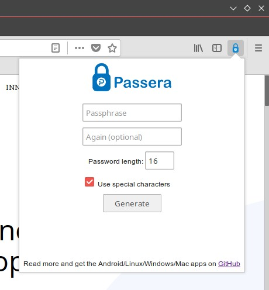

[//]: # (Filename: README.md)
[//]: # (Author: Iván Ruvalcaba)
[//]: # (Contact: <mario.i.ruvalcaba[at]gmail[dot]com>)
[//]: # (Created: 22 abr 2018 12:20:57)
[//]: # (Last Modified: 22 abr 2018 14:03:00)

> This project has been migrated to **GitLab**: [https://gitlab.com/ivanruvalcaba/passera](https://gitlab.com/ivanruvalcaba/passera) _(#GithubExodus)_.

# Passera

> Passera turns entered text into a strong password up to 64 characters long.

A simple tool that allows users to have strong unique passwords for each website, without the need to store them either locally or with an online service. It is available as a [command-line tool for Linux/Mac/Windows and an Android app](https://github.com/mwgg/passera).

## Passera as Firefox/Chrome-like Web-extension (Add-on)

This is a fork of the [original Passera Firefox Add-on](https://addons.mozilla.org/en-US/firefox/addon/passera/), ported like web-extension —currently in an early stage of development, a.k.a. _beta release_—. **This project is not intended to improve the encryption algorithm or security considerations.** The real objective of the project is to facilitate the use of the _Passera_ as a user tool.

## Install

### Firefox Web Browser

Get it from [AMO](https://addons.mozilla.org/en-US/firefox/addon/passera-webextension/).

### Chrome-like Web Browsers

Not yet releases available.

## Improvements

+ Added the functionality to copy the password to the clipboard.

## Known issues

+ It is currently not possible to regenerate a new password without closing the pop-up window.

## License

Dual BSD-GPL3 License.
